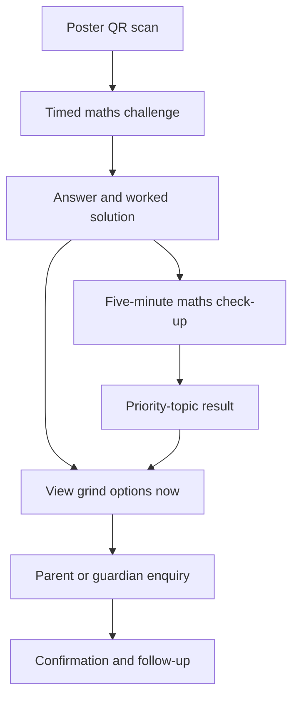

# LC Maths Poster Funnel — Codex Build Plan

## Instruction to Codex

Build the smallest production-capable mobile funnel that turns scans of the physical maths challenge poster into qualified enquiries for maths grinds.

Treat every product, visual and technical decision in this document as revisable. Inspect the existing repository before changing anything, preserve its established stack and conventions, and reuse existing components, styling, database access, validation, analytics and maths-rendering libraries wherever practical. Do not introduce a second framework or duplicate an existing system.

The prime objective of this funnel is **confirmed maths-grind bookings**. The challenge and diagnostic exist to earn attention, demonstrate value and qualify leads. Raw traffic, quiz engagement and referrals are secondary.

Keep the application runnable after every implementation phase. Do not modify unrelated features or refactor broad areas of the existing app unless required for this funnel.

## Product principles

1. **Continue the poster experience.** The first screen must feel like the poster came alive, not like the visitor has arrived on a generic tutoring homepage.
2. **Deliver the promised answer before requesting personal information.** Never gate the challenge answer or worked solution behind an email form.
3. **Let high-intent visitors bypass the game.** Every challenge/result screen should include a discreet route to grind availability.
4. **Move from student energy to parent trust.** The challenge can be aggressive and playful; the grind and booking screens should be calm, specific and credible.
5. **Collect the minimum data necessary.** The challenge and diagnostic should be anonymous. Parent/guardian contact details are requested only when the visitor wants to enquire about grinds.
6. **Measure the whole funnel.** Optimise for enquiries and bookings per 100 poster scans, not scans alone.
7. **Do not overbuild.** No accounts, payment system, referral rewards, leaderboards, school competitions, grade-prediction model or tutor marketplace in this version.

## Required user journey



The visitor must also be able to go directly from the challenge or result to the grind offer without completing the check-up.

## Initial route map

Adapt route syntax to the framework already used by the repository.

| Route intent | Suggested route | Purpose |
| --- | --- | --- |
| Poster challenge | `/challenge/:challengeId` | Recreate the poster challenge and accept an answer |
| Worked result | `/challenge/:challengeId/result` | Reveal correctness and a concise worked solution |
| Maths check-up | `/checkup` | Collect anonymous exam context and ask a small number of questions |
| Check-up result | `/checkup/result/:anonymousId` | Show priority topics and route to grinds or parent sharing |
| Grind offer | `/grinds` | Explain formats, genuine credentials, location, price and availability |
| Enquiry | `/grinds/enquire` | Collect parent/guardian details and preferred option |
| Confirmation | `/grinds/enquire/thanks` | Confirm receipt and explain the next step |

Separate URLs are preferred for meaningful stages because they allow reliable refresh/deep-link behaviour and cleaner funnel measurement. If the existing application strongly favours a single stateful route, preserve the same logical stages and browser history behaviour.

## Source attribution

Every poster QR should point to the challenge route with non-personal source parameters, for example:

```text
/challenge/algebra-01?source=poster&poster_id=timer-orange-01&location=donabate-library
```

Support and retain these parameters through the anonymous funnel:

- `source`
- `poster_id`
- `location`
- `creative`
- standard UTM parameters if present

Use an allow-list and length limits before persisting arbitrary query-string values. Store attribution with the anonymous session and attach it to the final enquiry. Do not request GPS location; the QR itself identifies the poster location.

## Page 1 — Timed challenge

### Objective

Convert the scan into immediate participation. Do not sell tutoring yet.

### Visual direction

- Match the physical poster: fluorescent orange, near-black and off-white.
- Mobile-first, full viewport and extremely sparse.
- No standard site header, navigation menu, testimonials, benefits list or generic hero section.
- The countdown is the first visual read; the question is second; answer controls are third.
- Maintain strong contrast and large tap targets.

### Initial content

```text
YOU'RE ALREADY BEING TIMED.
00:10

x + 1/x = 3
x² + 1/x² = ?

5    7    9    11

LOCK IN YOUR ANSWER
```

Render fractions using the maths renderer already present in the repository. If no renderer exists, prefer accessible MathML or a small existing-compatible solution; do not add a large duplicate dependency solely for this equation.

### Behaviour

- Start a ten-second visual countdown on first meaningful page load.
- The timer is motivational, not punitive. Answers remain selectable after it reaches zero.
- Selecting an answer should visibly select it; submission requires an explicit `Lock in answer` action unless the existing app pattern strongly supports immediate submission.
- Prevent accidental double submission.
- Record time-to-answer as an anonymous engagement metric, not as part of lead qualification.
- Include a small text link: `Already looking for grinds? See availability`.
- Preserve a sensible state after refresh and back navigation.
- Respect `prefers-reduced-motion`; the timer must remain understandable without animation.

## Page 2 — Result and solution

### Objective

Give the promised payoff, demonstrate teaching ability and offer the next useful action.

### Correct-result copy

```text
CORRECT — THE ANSWER IS 7.

(x + 1/x)² = x² + 2 + 1/x² = 9
Therefore x² + 1/x² = 7.

That was one question.
Do you know which topics are costing you marks?
```

### Incorrect-result copy

```text
THE ANSWER IS 7.

(x + 1/x)² = x² + 2 + 1/x² = 9
Therefore x² + 1/x² = 7.

The missing step was the middle +2 term.
Do you know which other topics are costing you marks?
```

Do not shame an incorrect visitor or make unsupported claims such as “most students get this wrong.”

### Calls to action

- Primary: `Find my priority topics — 5 minutes`
- Secondary: `See maths grind availability`

Use the same poster styling at the top of this screen, then begin transitioning toward the cleaner tutoring visual system.

## Page 3 — Five-minute maths check-up

### Objective

Provide a genuinely useful lightweight diagnosis without collecting personal information or pretending to predict an exam grade.

### Introductory context

Collect only non-identifying educational context:

- Leaving Cert or Junior Cycle
- School year
- Higher or Ordinary Level, where applicable
- Approximate current grade band, optional
- Target grade band, optional

### Question flow

- Ask five to seven questions maximum.
- Present one question per screen.
- Show progress, such as `Question 2 of 6`.
- Each question must have a single clearly defined skill tag.
- Questions, answers, solutions and skill tags must be data-driven and editable outside page components.
- Keep separate question sets for exam and level rather than pretending one set diagnoses every student.
- Seed the architecture with the initial poster question and clearly marked sample question data if final check-up content has not been supplied.
- Never publish placeholder or mathematically unverified questions. If final content is unavailable, keep the check-up behind a development feature flag while completing the conversion spine.

Suggested skill tags include:

- algebraic manipulation
- fractions and signs
- equations
- quadratics
- functions and graphs
- probability and statistics
- geometry and trigonometry
- calculus for the relevant Leaving Cert level only

### Scoring

- Calculate results deterministically from correct/incorrect answers and skill tags.
- Priority topics should be the skills attached to incorrect responses.
- Do not force exactly three weak topics when evidence does not support three.
- If the visitor answers everything correctly, show a `Strong start` result and suggest exam technique or harder questions rather than manufacturing weaknesses.
- Do not output a predicted grade or statistical percentile in this version.

Use session storage or an anonymous server-side session for non-personal progress. Do not place contact details or other personal data in local storage or result URLs.

## Page 4 — Check-up result

### Objective

Turn the diagnosis into a credible reason to consider tutoring.

### Result structure

```text
YOUR FIRST PRIORITIES

1. Algebraic manipulation
2. Fractions and signs
3. Quadratic equations

You handled direct calculations well. The first areas to revisit are questions
that combine several algebraic steps.
```

Copy must be generated from deterministic, reviewable templates linked to skill tags. Avoid claiming more certainty than a short diagnostic supports.

### Calls to action

- Primary: `See grind times and prices`
- Secondary: `Send this result to a parent or guardian`
- Tertiary: `Try another question`

Implement parent sharing with the Web Share API when available and a copy-link fallback. The shared result URL must use an opaque anonymous identifier and must not expose personal information. Suggested share copy:

```text
I tried this short maths check-up and these are the topics it suggested I work on. Could we look at the available grinds?
```

## Page 5 — Grind offer

### Objective

Answer the practical and trust questions a parent needs before making an enquiry.

### Visual direction

- Retain orange as an accent so the visitor recognises the journey.
- Move to a calmer off-white background and conventional readable typography.
- Use a genuine photograph of the tutor when supplied.
- This page may have simple navigation, but keep one dominant action.

### Required sections

1. **Clear headline**
   - Suggested: `Maths grinds focused on the topics your student is actually losing marks on.`
2. **Grind formats**
   - One-to-one, small group, online and/or in-person, but display only formats actually offered.
3. **Who the tutoring is for**
   - Exam, level and year groups genuinely supported.
4. **Location**
   - Exact service area or online availability.
5. **Price**
   - Show the real price or an accurate `from` price before requesting contact information.
6. **Availability**
   - Display genuine current slots or a clear statement that availability will be confirmed.
7. **Tutor profile**
   - Real name, accurate qualifications, concise approach and genuine relevant experience.
8. **Trust evidence**
   - Only genuine testimonials, results, vetting or other proof supplied by the owner. Hide this section when no verified content exists.
9. **Primary CTA**
   - `Request a grind` or `Request this time`.
10. **Secondary CTA**
   - Optional `Ask a question on WhatsApp` when a real business contact number is configured.

### Configuration requirement

Create one typed/configured source of truth for all owner-controlled business information. It should include:

- tutor name
- profile image reference
- credential wording
- tutoring formats
- exams and levels supported
- areas served
- prices
- available or preferred time slots
- enquiry destination
- WhatsApp number if used
- response-time promise
- testimonials and their approval status
- privacy contact and policy URL

Render only configured, non-empty information. Never invent a price, qualification, testimonial, student result, scarcity claim, vetting status or available slot. In development, missing values may appear in a clearly labelled setup checklist, but public pages must not show fake placeholders.

## Page 6 — Parent or guardian enquiry

### Objective

Capture enough information to arrange a suitable session with minimal friction.

### Form fields

- Parent or guardian name
- Preferred contact method
- Email address or phone number, according to the selected method
- Student exam/year
- Student level
- Preferred grind format
- Preferred slot or general availability
- Optional message
- Required acknowledgement of the privacy notice
- Separate optional marketing opt-in only if marketing messages will actually be sent

Student name should be optional until it is operationally necessary. Do not request date of birth, school name, home address or other unnecessary data in the initial form.

Prefill exam, level, preferred format, source attribution and anonymous diagnostic summary when available. Do not prefill or infer personal data.

### Submission behaviour

- Validate on both client and server.
- Disable repeated submissions while a request is in flight.
- Use a honeypot and conservative server-side rate limiting before adding a high-friction CAPTCHA.
- Persist the enquiry in the existing datastore.
- Deliver a notification using the project’s existing email or messaging system if one exists.
- Do not add a paid external service without owner approval.
- Return a clear recoverable error without losing entered data when submission fails.
- Do not present an enquiry as a confirmed booking unless a real calendar/booking system confirms it.

## Page 7 — Confirmation

Suggested copy:

```text
REQUEST RECEIVED

Thanks — your grind request has been sent.
I’ll contact you within [configured response time] to confirm the best option.
```

Show a concise summary of the request and the configured contact channel. Provide a safe way to submit another request or return to the main app.

## Data and content model

Adapt names to existing conventions. Static educational content may live in validated TypeScript/JSON configuration; personal enquiries must use persistent server-side storage.

### Challenge definition

```ts
type Challenge = {
  id: string;
  title: string;
  prompt: string;
  answerOptions: string[];
  correctAnswer: string;
  solutionSteps: string[];
  skillTags: string[];
  timerSeconds: number;
  active: boolean;
};
```

### Diagnostic question

```ts
type DiagnosticQuestion = {
  id: string;
  exam: "junior-cycle" | "leaving-cert";
  level: string;
  prompt: string;
  answerOptions: string[];
  correctAnswer: string;
  solution: string;
  skillTag: string;
  active: boolean;
};
```

### Anonymous funnel session

```ts
type FunnelSession = {
  id: string;
  createdAt: string;
  challengeId: string;
  attribution: Record<string, string>;
  examContext?: Record<string, string>;
  diagnosticSummary?: {
    answered: number;
    correct: number;
    prioritySkills: string[];
  };
};
```

### Grind enquiry

```ts
type GrindEnquiry = {
  id: string;
  createdAt: string;
  guardianName: string;
  contactMethod: "email" | "phone";
  contactValue: string;
  exam: string;
  year: string;
  level: string;
  preferredFormat?: string;
  preferredSlot?: string;
  message?: string;
  privacyAcknowledgedAt: string;
  marketingOptIn?: boolean;
  funnelSessionId?: string;
  attribution: Record<string, string>;
  status: "new" | "contacted" | "booked" | "closed";
};
```

Do not expose enquiry identifiers sequentially. Enquiry status changes may remain an internal/manual process for the MVP; an admin dashboard is not required.

## Funnel analytics

Use the project’s existing analytics system if present. Otherwise create a minimal first-party event abstraction that can later be connected to an analytics provider.

Track these events with anonymous session and attribution data:

| Event | Important properties |
| --- | --- |
| `challenge_viewed` | challenge, poster, location, creative |
| `challenge_answered` | challenge, correct, time-to-answer |
| `solution_viewed` | challenge, correct |
| `checkup_started` | exam, level |
| `checkup_completed` | questions answered, correct count, priority skills |
| `grinds_viewed` | entry stage, configured offer variant |
| `enquiry_started` | entry stage |
| `enquiry_submitted` | format, slot, source attribution |
| `booking_confirmed` | manually or automatically recorded later |

Do not send contact details, student information, free-text messages or maths results to third-party analytics. Avoid storing raw IP addresses unless an existing security mechanism requires them and has an appropriate retention policy.

The primary reporting metric is:

```text
confirmed bookings / unique poster scans
```

Secondary metrics are answer rate, check-up completion rate, grind-page view rate, enquiry rate and enquiry-to-booking rate.

## Privacy and safeguarding requirements

- Let visitors complete the challenge and diagnostic without entering personal information.
- Direct the booking form toward a parent or guardian.
- Use clear age-appropriate copy.
- Link a concise privacy notice at the enquiry form.
- Record the privacy-notice version acknowledged with the enquiry.
- Use data minimisation and define a retention period for unsuccessful enquiries.
- Do not bundle marketing consent into the grind enquiry.
- Do not implement behavioural advertising or profiling of children.
- Do not make unsupported grade predictions or expose a child’s result publicly.
- Treat the exact legal basis, retention period and privacy wording as owner/legal-review inputs; do not invent legal assurances.

## Accessibility and performance

- Target a mobile viewport first, including widths down to 320 px.
- Use semantic HTML and keyboard-operable controls.
- Provide visible focus states and labels for all form fields.
- Maintain WCAG-compatible contrast despite the aggressive poster palette.
- Use live regions carefully for the countdown and result; do not announce every timer tick to screen readers.
- Respect reduced-motion settings.
- Ensure mathematical content has an accessible text representation.
- Avoid large hero images, video backgrounds and unnecessary client JavaScript.
- Optimise for a near-instant first interaction on a normal mobile connection.
- The main challenge must remain usable if animation fails.

## Implementation phases

### Phase 0 — Repository audit

Before editing:

1. Read repository instructions and relevant documentation.
2. Identify framework, routing, styling, maths rendering, validation, database, analytics, testing and deployment patterns.
3. Identify existing reusable quiz/question and tutoring components.
4. Check for a `.openai/hosting.json` file and follow the repository’s hosting workflow when present.
5. Record assumptions and required owner inputs.
6. Do not replace the current stack merely because another stack would be convenient.

### Phase 1 — Conversion spine

Build and verify:

1. Data-driven challenge definition.
2. Poster-matched challenge page.
3. Countdown and answer handling.
4. Correct/incorrect worked-result screen.
5. Direct route to a basic grind offer.
6. Config-driven owner information.
7. Parent/guardian enquiry form.
8. Persistent submission and confirmation screen.
9. Source attribution carried into the enquiry.

This phase must work end to end before adding the diagnostic.

### Phase 2 — Diagnostic and parent handoff

1. Add exam/year/level selection.
2. Add data-driven check-up questions behind a feature flag.
3. Implement deterministic scoring and priority-topic copy.
4. Add the anonymous result route.
5. Add Web Share/copy-link parent handoff.
6. Prefill relevant non-personal context in the enquiry form.
7. Enable publicly only after all question content is mathematically reviewed.

### Phase 3 — Measurement and hardening

1. Add funnel events and verify attribution.
2. Add form rate limiting and spam protection.
3. Add unit, integration and end-to-end tests.
4. Run accessibility and mobile QA.
5. Run production build, linting and type checks.
6. Test refresh, back-button, duplicate submission and offline/failure states.
7. Document how to create a new challenge and poster-specific QR link.

## Testing requirements

### Unit tests

- Challenge answer evaluation
- Diagnostic scoring by skill tag
- Result-template selection
- Query attribution allow-listing
- Form schema validation
- Business configuration validation

### Integration tests

- Poster parameters persist into a successful enquiry
- No personal information is required before the enquiry stage
- Correct and incorrect answer paths show the correct solution
- High-intent visitor can bypass the diagnostic
- Diagnostic context prefills the enquiry form
- Failed enquiry retains safe client-side form state
- Duplicate submission is prevented

### End-to-end tests

At minimum test on a mobile viewport:

1. Scan-equivalent URL → answer → solution → grind offer → enquiry → confirmation.
2. Scan-equivalent URL → answer → check-up → result → parent share → grind offer.
3. Direct visitor → grind offer → enquiry.
4. Invalid challenge ID and expired/inactive challenge handling.
5. JavaScript or network failure around form submission.

## Acceptance criteria

The feature is complete when:

- A poster QR can open a challenge with its source/location attached.
- The first screen visually continues the orange countdown poster.
- A visitor can answer without providing personal information.
- Correct and incorrect results show an accurate worked solution.
- A high-intent visitor can reach grind details in one additional tap.
- A visitor can complete the optional check-up anonymously when enabled.
- The result accurately reflects deterministic skill-tag scoring.
- A visitor can share a non-personal result with a parent or guardian.
- Grind formats, prices, slots and tutor details come from validated owner configuration.
- No invented business claims appear when configuration is missing.
- A parent/guardian can submit an enquiry that persists successfully.
- The enquiry retains poster attribution and relevant anonymous context.
- The confirmation clearly distinguishes a request from a confirmed booking.
- Required analytics events fire once with no contact details included.
- The funnel passes the existing repository’s build, type, lint and test commands.
- Core flows work at 320 px width and with keyboard navigation.

## Explicit non-goals

Do not build the following in this implementation:

- Student accounts or authentication
- Payments or deposits
- A live calendar integration unless one already exists
- Tutor recruitment or tutor marketplace functionality
- Referral rewards or daily-question unlocks
- Streaks, leaderboards or school competitions
- AI-generated diagnoses
- Predicted grades or national percentiles
- A full content-management system
- An admin dashboard
- Automated marketing sequences
- Multiple visual funnel variants before the first one is measurable

## Owner inputs required before public launch

Codex must surface these as a concise checklist rather than inventing answers:

- Exact tutor name and approved profile photograph
- Final qualification and experience wording
- Exams, years and levels accepted
- One-to-one/group and online/in-person formats offered
- Service locations
- Prices
- Current availability or process for confirming it
- Enquiry notification email/phone destination
- WhatsApp number, if used
- Realistic response-time promise
- Approved testimonials, if any
- Final diagnostic questions and worked solutions
- Privacy notice, privacy contact and retention decision

## Codex handoff requirements

When implementation is complete, report:

1. What was built and the exact routes.
2. Important files added or changed.
3. Database migrations and environment variables required.
4. How to edit challenges, check-up questions and grind information.
5. Tests and verification commands run, including results.
6. Remaining owner inputs and any feature flags still disabled.
7. The exact URL pattern to encode in each poster QR.

Do not claim the funnel is production-ready if persistent enquiry delivery, owner configuration, privacy copy or mathematically reviewed question content is still missing.
